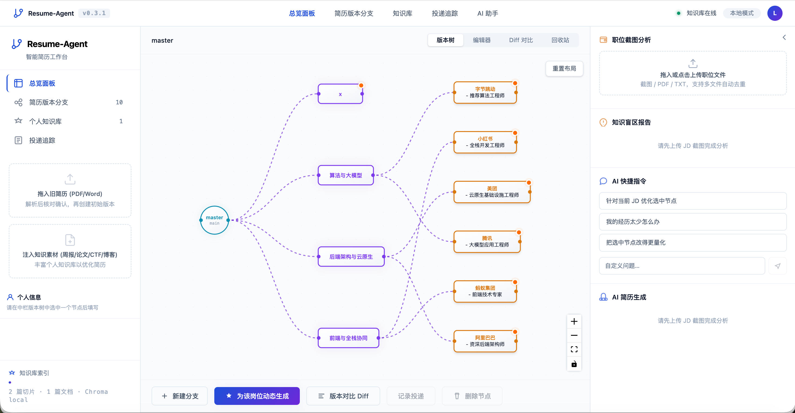
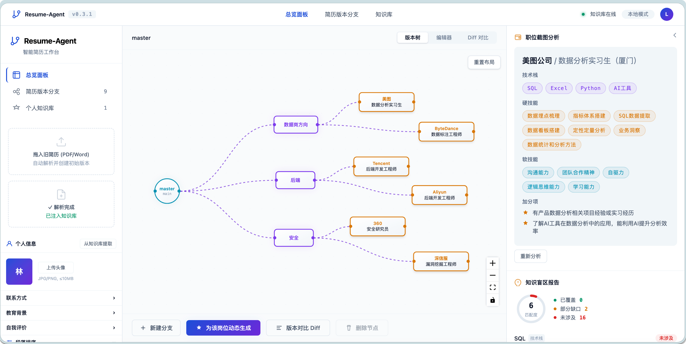
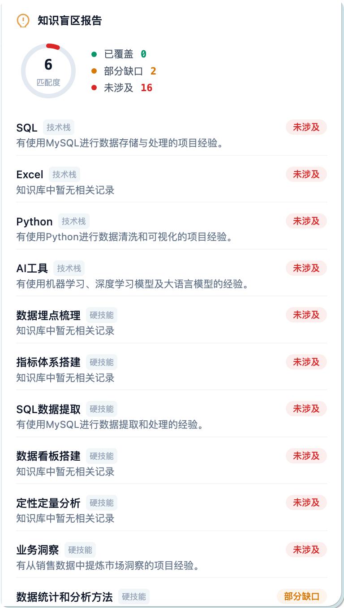
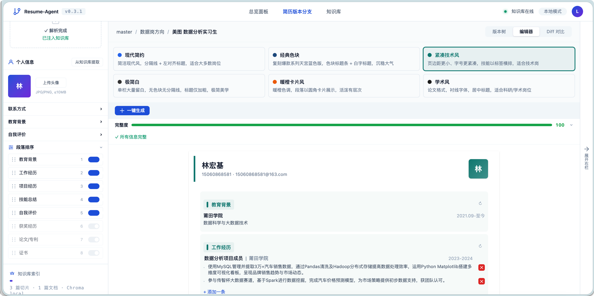
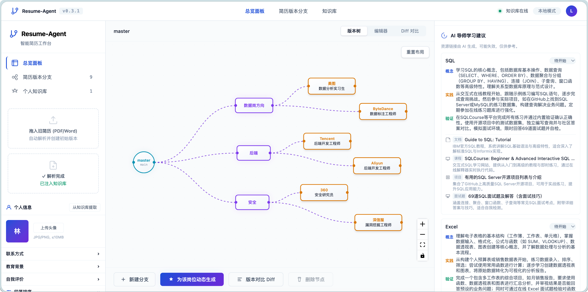
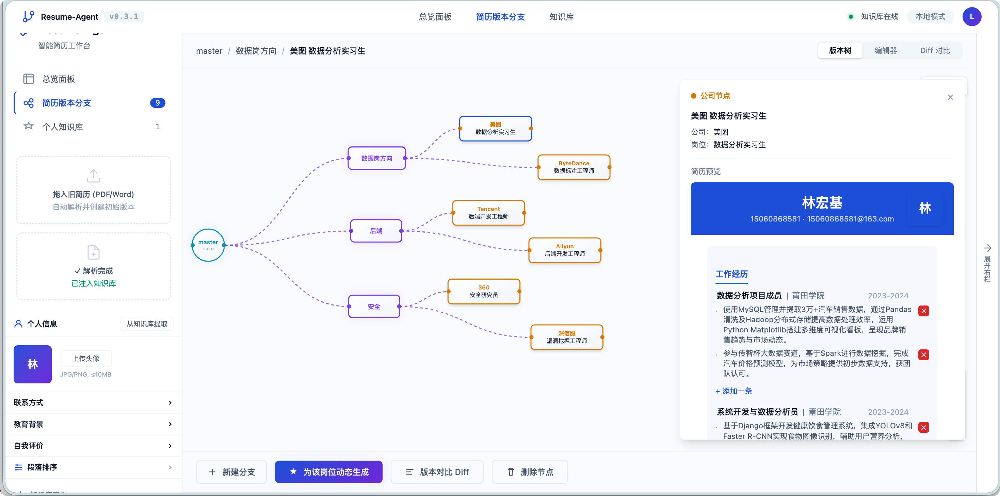

# Resume-Agent v2.0

[](https://github.com/DeLightor/resume_agent)
[](https://python.org)
[](https://fastapi.tiangolo.com)
[](https://react.dev)
[](tests)
[](LICENSE)

> **把简历当代码仓库来管**：Git 式版本树 + RAG 知识库 + 智能体双审编排 + 全生命周期求职工作台。

技术求职者手里从来不是「一份简历」，而是十几份针对不同公司、不同方向裁剪过的版本。**Resume-Agent v2.0** 用 Git 的方式管理这整片「简历森林」——Master 主干分化方向分支，分支长出公司专属节点，改一次主干所有子分支自动继承。系统内置原生自驱动智能体引擎与 Reviewer 双审机制，配合投递看板与素材挖掘，让求职全流程迈入 2.0 智能化时代。

<p align="center">
  
</p>

### 核心亮点

- 🌲 **Git 式简历版本树**：Master 主干 → 方向分支 → 公司节点，支持细粒度继承与内容级选择性变更合并。
- 🤖 **原生 Agent Loop 架构**：工具注册表驱动自主调用，SSE 实时流式响应，多步动作链路清晰透明。
- 🛡️ **Reviewer Agent 双审机制**：独立上下文审查，严守知识库事实边界，杜绝 AI 虚构量化数据与套话。
- 📑 **两阶段解析与置信度核对**：多模态旧简历解析后支持逐字段置信度校验与修正，杜绝脏数据污染知识库。
- 🔒 **工业级编辑保护三件套**：800ms 防抖自动存盘、乐观并发锁版本控制、20 步撤销重做（⌘Z/⌘⇧Z）与 30 天软删除回收站。
- 🎯 **求职全生命周期闭环**：支持零实习应届生 STAR 对话素材挖掘，集成岗位投递看板与版本快照冻结。
- 📄 **ATS 友好与物理分页对齐**：6 套专业简历模板，前端 A4 分页虚线感知与 ReportLab PDF 导出严格像素级对齐。

## 快速开始

### 方式一：Docker Compose（推荐）

```bash
git clone https://github.com/DeLightor/resume_agent.git
cd resume_agent
cp .env.example .env
# 编辑 .env 填入 LLM_API_KEY 和 MINERU_API_TOKEN
docker compose up
```

访问 http://localhost:5173

### 方式二：源码开发

```bash
git clone https://github.com/DeLightor/resume_agent.git
cd resume_agent
make install    # 安装前后端依赖（需要 uv + pnpm）
make dev        # 启动开发服务器
```

- 前端：http://localhost:5173
- API：http://localhost:8000
- API 文档：http://localhost:8000/docs

## 前置要求

| 工具 | 版本 | macOS / Linux | Windows |
|------|------|---------------|---------|
| Node.js | ≥ 20 | [nodejs.org](https://nodejs.org/) | [nodejs.org](https://nodejs.org/) |
| pnpm | ≥ 9 | `npm install -g pnpm` | `npm install -g pnpm` |
| Python | ≥ 3.10 | [python.org](https://python.org/) | [python.org](https://python.org/) |
| uv | latest | `curl -LsSf https://astral.sh/uv/install.sh \| sh` | `powershell -c "irm https://astral.sh/uv/install.ps1 \| iex"` |
| Docker | ≥ 24（可选） | [docker.com](https://docker.com/) | [docker.com](https://docker.com/) |

## 快速安装

### macOS / Linux

```bash
./install.sh
```

脚本会自动检测环境、安装依赖、引导配置 LLM API Key 和 MinerU Token。

### Windows

```powershell
# 一键安装（检测环境 + 安装依赖 + 配置 LLM + MinerU）
powershell -ExecutionPolicy Bypass -File install.ps1

# 日常开发命令
powershell -ExecutionPolicy Bypass -File Makefile.ps1 dev        # 启动开发服务器
powershell -ExecutionPolicy Bypass -File Makefile.ps1 test       # 运行测试
powershell -ExecutionPolicy Bypass -File Makefile.ps1 build      # 构建前端
powershell -ExecutionPolicy Bypass -File Makefile.ps1 install     # 安装依赖
powershell -ExecutionPolicy Bypass -File Makefile.ps1 clean       # 清理构建产物
```

> **注意**：Windows 上不要直接 `.\Makefile.ps1 dev`，会被记事本打开。必须用 `powershell -ExecutionPolicy Bypass -File` 执行。

Windows 数据存储路径：`%USERPROFILE%\.resume-agent\`（自动创建）

### Docker 一键启动（无需上述依赖）

```bash
docker compose up
```

访问 `http://localhost:5173` 即可使用。

## 配置

复制 `.env.example` 为 `.env` 并填入以下配置（或运行安装脚本自动引导）：

### LLM 配置（必需）

```bash
LLM_PROVIDER=deepseek              # openai / deepseek / custom
LLM_API_KEY=sk-xxxxxxxx             # API Key
LLM_BASE_URL=https://api.deepseek.com  # OpenAI 兼容端点（不带 /v1）
LLM_MODEL=deepseek-v4-pro           # 模型名
```

支持任何 OpenAI 协议兼容的 LLM 服务（DeepSeek、OpenAI、Moonshot、本地 Ollama 等）。

### MinerU 配置（简历解析必需）

```bash
MINERU_API_TOKEN=                   # 在 https://mineru.net/apiManage 获取
MINERU_API_BASE=https://mineru.net
```

MinerU 提供云端文档解析 API，用于简历上传解析和 JD 截图 OCR。有免费额度，无需自建部署。

### Tavily 配置（AI 导师学习建议，可选）

```bash
TAVILY_API_KEY=tvly-dev-xxxxxxxx     # 在 https://tavily.com 获取
```

Tavily 提供 Web 搜索 API，用于 AI 导师为技能缺口推荐真实有效的学习资源链接。有免费额度（1000 次/月）。`tavily-python` 已纳入 `pyproject.toml` 依赖，`uv sync` 自动安装。未配置 API Key 时降级为 LLM 训练数据生成的链接。

### Embedding 配置

知识库向量检索使用 Chroma 内置的 `all-MiniLM-L6-v2` 本地模型，无需额外配置 API Key，开箱即用。

### 数据存储

```bash
RESUME_AGENT_HOME=~/.resume-agent
SQLITE_PATH=~/.resume-agent/data.db
CHROMA_PATH=~/.resume-agent/chroma
FILES_ROOT=~/.resume-agent/files
```

## 技术栈

| 层 | 技术 | 说明 |
|----|------|------|
| **前端** | React 18 + Vite + TypeScript + Tailwind CSS v4 + React Flow v12 | 树状版本画布、全生命周期工作台、响应式设计令牌与微动画体系 |
| **通信机制** | Server-Sent Events (SSE) 流式传输 | 实时推送 Agent `thinking` / `tool_call` / `review` / `draft` 状态与长任务进度 |
| **后端** | Python 3.10+ + FastAPI + uvicorn | 高性能异步架构、自研 Agent Loop 智能体引擎 |
| **数据库** | SQLite（原生 WAL 模式） | 存储简历版本树快照、投递追踪记录、乐观并发锁版本号、30 天软删除回收站 |
| **向量检索** | Chroma（嵌入式 PersistentClient） | `all-MiniLM-L6-v2` 本地模型，支持素材向量索引与精准语义检索 |
| **智能体 / LLM** | 原生 Agent Loop + OpenAI / DeepSeek 协议兼容 | 工具注册表自动调度、Drafter-Reviewer 双审机制、长期记忆系统注入 |
| **文档与截图 OCR** | MinerU 云端 API | 支持 PDF / Word / 图片多模态解析，结合字段级置信度评估与双阶段核对流 |
| **外部检索** | Tavily Search API | AI 导师驱动，精准挖掘技能缺口对应的真实技术文档与实战开源项目链接 |
| **PDF 排版引擎** | ReportLab (Python) | ATS 友好、文本可选可解析，支持 CJK 中文字体，前端物理 A4 分页虚线对齐 |
| **部署与运维** | Docker Compose / 原生轻量脚本 | 单容器镜像封装，支持 macOS / Linux (`install.sh`) 与 Windows (`install.ps1`) |

## 核心功能与界面演示

### 1. Git 式简历版本树与全生命周期工作台
把简历当代码仓库管理：Master 主干分化方向分支，分支派生公司专属定制。右侧全局集成 AI 对话助手、职位截图分析、技能盲区诊断与投递追踪。

<p align="center">
  
</p>

### 2. 职位截图分析与多模态 OCR
支持直接拖拽、粘贴招聘页面截图或上传 PDF/TXT 职位描述。MinerU 云端 OCR 毫秒级提取，LLM 深度解构硬性技术要求、项目门槛与加分项。

<p align="center">
  
</p>

### 3. 知识盲区诊断与技能 Gap 深度报告
将目标岗位能力画像与个人知识库进行多维向量相似度比对，以红、黄、绿三色直观判定技能覆盖度，精准指引简历优化与学习方向。

<p align="center">
  
</p>

### 4. 简历编辑器、自由拖拽排序与 6 大精美模板
提供现代、技术、经典、极简、暖橙卡片风与学术 6 套 ATS 友好的专业模板。支持 8 大段落自由拖拽排序、显示隐藏、内联实时编辑与完整度检测。

<p align="center">
  
</p>

### 5. AI 导师学习建议与实战资源推荐
针对技能缺口，联动 Tavily 实时检索高质量技术资源，为求职者规划「概念认知 → 动手实践 → 成果验证」的学习路径，并提供真实可访问的权威文档与项目链接。

<p align="center">
  
</p>

### 6. 简历版本分支与多模板实时预览
多分支精细对比，支持 A4 分页物理边界预警，确保导出 PDF 前排版不溢出、不换页，实现所见即所得。

<p align="center">
  
</p>

## 功能概览

### v2.0 智能体架构与全生命周期工作台（全新升级）

| 模块 / 故事 | 核心能力与特性 |
|------------|----------------|
| **Agent Runtime 与工具注册表 (US-27)** | 统一 `Tool` 协议（8+ 核心工具封装），DeepSeek / OpenAI Function Calling 多轮自驱动循环，结构化 trace 记录与主动中断询问交互 |
| **SSE 流式与 Agent 行为面板 (US-28)** | `text/event-stream` 全程推送 `thinking` / `tool_call` / `review` / `draft`，时间线可视化展开入参出参，告别转圈黑盒 |
| **对话式工作台 (US-29)** | 右栏全局 AI 对话入口，深度结合当前节点、目标 JD 与 Gap 报告，支持自然语言调优、项目经历量化润色与即时建议采纳 |
| **Reviewer Agent 双审机制 (US-30)** | Drafter-Reviewer 架构解耦，独立审查上下文，严格把控知识库事实边界，杜绝 AI 虚构量化数据、套话检测并给出修改意见 |
| **两阶段解析确认流 (US-31)** | 旧简历与 JD 解析引入「异步提取 → 字段级置信度核对 → 确认入库」流程，低置信度高亮提示，杜绝错误数据污染知识库与 RAG |
| **编辑保护三件套 (US-32)** | 800ms 防抖自动存盘、乐观并发锁版本控制、AI 生成结果 Diff 预览卡片、20 步撤销重做（⌘Z/⌘⇧Z）与 30 天软删除回收站 |
| **内容级上游合并 (US-33)** | 主干 Master 修改后自动向下追踪 experience / projects / skills 细粒度变更，支持条目级与段落级可视化选择性合并与冲突处理 |
| **A4 预览分页与物理边界 (US-34)** | 前端简历实时渲染 A4 分页指示线与页数预警，与后端 ReportLab PDF 导出排版物理对齐，确保技术简历「一页纸」原则 |
| **Agent 长期记忆系统 (US-35)** | 用户习惯、修改偏好与纠错指示沉淀为长期记忆库，Top-K 动态注入审查流程，越用越默契 |
| **应届生追问式冷启动 (US-36)** | 针对经历单薄的应届生，智能导师追问式挖掘课程设计、学术科研、学科竞赛等经历，提炼标准 STAR 结构直接沉淀入库 |
| **投递追踪与版本闭环 (US-37)** | 求职全生命周期看板，锁定投递时点简历快照与目标岗位上下文，追踪状态流转与跟进日程，告别投递版本混乱 |

### v1.4 UI 精简与视觉增强

| 功能 | 说明 |
|------|------|
| 导航精简与联动 | 3 项导航 + 动态 badge + GlobalToolbar 统一联动 + "简历版本分支"收起右栏扩大中栏空间 |
| 底部生成联动 | 点击"为该岗位动态生成"自动跳转编辑器，检测 JD 状态，无 JD 自动展开右栏 |
| 节点位置持久化 | 拖拽位置存入 localStorage（版本前缀 key），刷新后保持，一键重置布局 |
| 简历个人头像 | 默认字母头像 + 上传替换（canvas 裁剪），6 套模板渲染 + PDF 导出，≤10MB |
| 节点 hover tooltip | 悬停 500ms 显示名称/类型/完整度/上游变更/时间，createPortal 绕过 React Flow transform |
| 色彩增强与动画 | 品牌色加深（#1d4ed8/#6d28d9）+ 渐变 + 3 入场动画 + 5 交互微动画 + prefers-reduced-motion |

### v1.3 上游变更与跨平台

| 功能 | 说明 |
|------|------|
| 上游变更检测 | 修改 master 个人信息后，子节点自动标记橙色徽标，提示有变更待合并 |
| 选择性合并 Diff | 逐字段 diff 渲染（中文字段名 + 旧值删除线 → 新值高亮），逐条接受/拒绝或全部接受 |
| 一键安装脚本 | macOS/Linux `install.sh` + Windows `install.ps1`，环境检测 + 依赖安装 + LLM/MinerU 配置引导 |
| Windows 原生支持 | `Makefile.ps1` 等效 Makefile（dev/build/test/lint/clean），PowerShell 跨平台脚本 |

### v1.2 简历精调与模板

| 功能 | 说明 |
|------|------|
| 个人信息管理 | 左栏知识库表单，联系方式/教育背景/自我评价，节点继承，知识库提取 |
| 段落可排序 | 拖拽调整 8 段落顺序，显示/隐藏切换，实时预览刷新 |
| 一键生成整份简历 | asyncio.gather 并行生成，JD 驱动，单段可重生成 |
| 信息完整性检测 | 0-100 评分 + 8 项检查清单，缺失字段高亮，可编辑预览（内联编辑 + 增删条目） |
| 6 套模板系统 | modern/classic/tech/minimal/暖橙卡片风/academic，配置化 TemplateConfig，半透明圆角背景框 |

### v1.1 增强功能

| 功能 | 说明 |
|------|------|
| 简历预览与模板 | 3 套内置模板（modern/classic/tech），实时预览，模板选择器 |
| AI 智能补全 | Gap 报告驱动，建议卡片，逐条采纳，分段缓存 |
| 版本 Diff 对比 | 字段级 diff（experience/projects/skills），结构化卡片渲染，新增/删除/修改高亮 |
| AI 导师学习建议 | Tavily Web 搜索 + 并行 LLM 调用，学习路径（概念→实践→验证）+ 真实资源链接 + 状态标记 |

### v1.0 MVP 核心功能

| 功能 | 说明 |
|------|------|
| 版本树管理 | Git 式树状画布，主干 → 方向分支 → 公司节点 |
| 知识库 RAG | 上传文档 → 自动分块 → 向量索引 → 语义检索 |
| JD 截图分析 | 多文件上传（截图/PDF/TXT）→ MinerU OCR → LLM 结构化提取 → 自动去重 |
| 技能 Gap 报告 | JD 技能 vs 知识库 → 向量相似度三色判定（已覆盖/部分缺口/未涉及） |
| AI 简历生成 | 检索 → 反思审核 → 撰写润色（3 步工作流，不依赖 LangGraph） |
| PDF 导出 | ATS 友好模板，文本可选可解析，支持中文 |

## 项目结构

```
resume-agent/
├── backend/              # Python 后端
│   ├── src/resume_agent/
│   │   ├── api/          # FastAPI 路由（tree/knowledge/jd/gap_report/generate/export/diff/suggest/tutor/templates/completeness/upstream/agent/mining/applications）
│   │   ├── agents/       # Agent Runtime（Agent Loop、Reviewer 审查、Memory 长期记忆、Tools 注册表）
│   │   ├── services/     # 核心业务服务（版本树、知识库检索、JD/Gap 分析、投递追踪、素材挖掘）
│   │   ├── db/           # SQLite 数据库层 + schema 迁移 + 软删除与乐观锁
│   │   ├── rag/          # Chroma 向量库 + 文本分块
│   │   ├── parsers/      # MinerU 简历/JD 多模态解析与置信度评估
│   │   ├── llm/          # 统一 LLM 客户端（OpenAI/DeepSeek，支持 tool use & streaming）
│   │   ├── tools/        # Agent 工具封装 + 外部工具（Tavily Web 搜索等）
│   │   ├── export/       # PDF 生成（reportlab，多模板与物理分页对齐）
│   │   ├── config.py     # 环境变量配置
│   │   └── main.py       # FastAPI 入口
│   └── tests/            # pytest 测试（480+ tests）
├── frontend/             # React 前端
│   ├── src/
│   │   ├── components/   # 组件（layout/tree/knowledge/jd/gap/generate/diff/tutor/template/applications/mining/agent）
│   │   ├── lib/          # API 封装与 SSE 流客户端
│   │   ├── styles/       # 设计令牌 + Tailwind CSS v4
│   │   └── types/        # TypeScript 类型定义
│   └── vite.config.ts
├── docs/                 # 项目文档与物料
│   └── images/           # README 与文档视觉素材截图
├── PRD-v2.0.md           # v2.0 需求与架构规格说明书
├── PRD.md                # v1.x 历史需求说明书
├── docker-compose.yml
├── Dockerfile
├── Makefile
├── Makefile.ps1          # Windows PowerShell Makefile
├── install.sh            # macOS/Linux 安装脚本
├── install.ps1           # Windows 安装脚本
└── .env.example
```

## 开发命令

### macOS / Linux

```bash
make install    # 安装依赖
make dev        # 启动开发服务器（前后端热更新）
make build      # 构建前端
make test       # 运行测试
make lint       # 代码检查
make docker-build  # Docker 构建
make docker-up     # Docker 启动
```

### Windows

```powershell
powershell -ExecutionPolicy Bypass -File Makefile.ps1 dev
powershell -ExecutionPolicy Bypass -File Makefile.ps1 test
powershell -ExecutionPolicy Bypass -File Makefile.ps1 build
```

## 数据存储

所有数据默认存储在 `~/.resume-agent/`（Windows 为 `%USERPROFILE%\.resume-agent\`）：

```
~/.resume-agent/
├── data.db          # SQLite 元数据（版本树、上传记录）
├── chroma/          # Chroma 向量索引（all-MiniLM-L6-v2）
└── files/           # 上传的原始文件 + 导出的 PDF
```

## Windows 常见问题

<details>
<summary>Q: 运行 <code>.\Makefile.ps1 dev</code> 弹出了记事本</summary>

Windows 默认用记事本打开 `.ps1` 文件。必须用 `powershell -ExecutionPolicy Bypass -File` 执行：

```powershell
powershell -ExecutionPolicy Bypass -File Makefile.ps1 dev
```
</details>

<details>
<summary>Q: <code>pnpm install</code> 报 <code>packages field missing</code></summary>

确保 `frontend/` 目录下没有 `pnpm-workspace.yaml` 文件。如果存在，删除它：

```powershell
del frontend\pnpm-workspace.yaml
```
</details>

<details>
<summary>Q: 后端启动正常，但前端显示"LLM 未配置"</summary>

后端从项目根目录读取 `.env` 文件。确保 `.env` 在项目根目录（不是 `backend/` 目录），且 `LLM_API_KEY` 有值：

```powershell
# 查看 .env 内容
cat .env

# 如果缺失，重新运行安装脚本
powershell -ExecutionPolicy Bypass -File install.ps1
```
</details>

<details>
<summary>Q: Docker 显示已安装但报错</summary>

Docker Desktop 未运行。启动 Docker Desktop 后重试，或忽略此警告（不影响本地开发）。
</details>

## License

MIT
